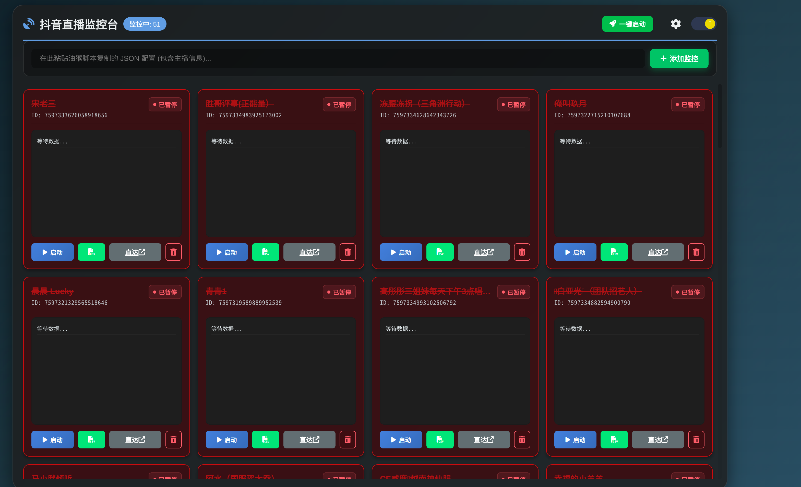
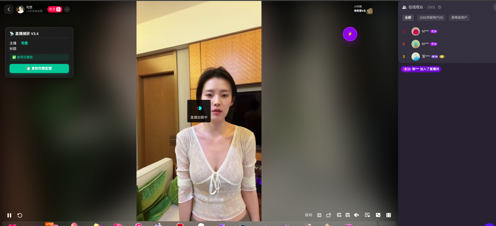
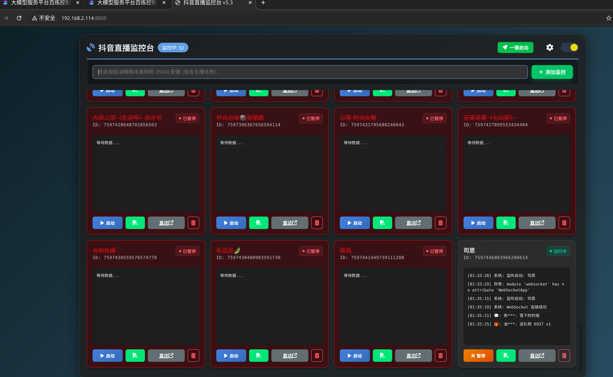
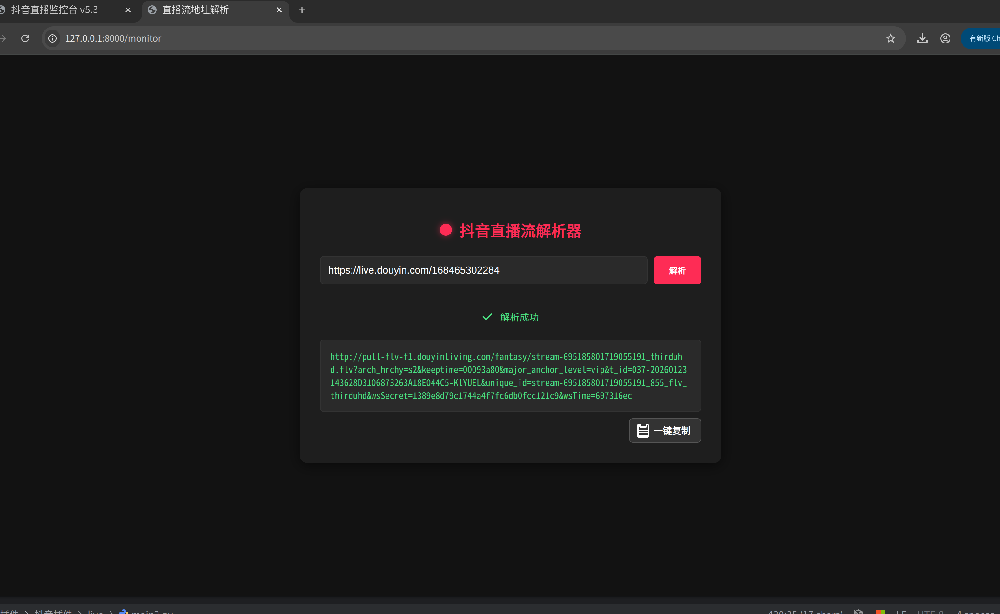

# 抖音直播i间弹幕录制软件

## 使用教程
1. 环境安装
```shell 
uv sync
```
2. 启动任务
```shell
uv run main.py
```

3. 浏览器打开监控台
```shell
http://127.0.0.1:8000/ 
```

4. 点击界面的齿轮，正确配置mysql数据库连接信息
```shell
# 创建数据库
CREATE DATABASE IF NOT EXISTS network_capture DEFAULT CHARSET utf8mb4 COLLATE utf8mb4_unicode_ci;
# 创建数据表
USE network_capture;

CREATE TABLE IF NOT EXISTS live_danmaku (
    id INT AUTO_INCREMENT PRIMARY KEY,
    room_id VARCHAR(50) COMMENT '直播间ID',
    user_nick VARCHAR(100) COMMENT '用户昵称',
    user_uid VARCHAR(50) COMMENT '用户UID',
    display_id VARCHAR(50) COMMENT '抖音号/短号',
    content TEXT COMMENT '弹幕内容',
    gender VARCHAR(10) COMMENT '性别',
    avatar_url TEXT COMMENT '头像链接',
    capture_time TIMESTAMP DEFAULT CURRENT_TIMESTAMP COMMENT '抓取时间'
);

ALTER TABLE live_danmaku ADD COLUMN msg_type VARCHAR(20) DEFAULT 'chat' COMMENT '消息类型';
ALTER TABLE live_danmaku ADD COLUMN gift_id VARCHAR(50) DEFAULT '' COMMENT '礼物ID';
ALTER TABLE live_danmaku ADD COLUMN gift_count INT DEFAULT 0 COMMENT '礼物数量/连击数';

CREATE INDEX idx_msg_type ON live_danmaku(msg_type);
 
```
5. 重建proto
```shell
python -m grpc_tools.protoc -I. --python_out=. dy.proto 
```
6. 浏览器安装油候脚本（省略）
7. 安装douyin.js脚本
8. 点开直播界面，复制ws地址到监控台即可



